# SlopeCraft Tutorial

This document will show you how to use SlopeCraft to create 3d, flat and file-only maps.

You can find the option to switch languages in the Languages drop-down menu in the menu bar.

To eliminate ambiguity, the defination of serveral terms are listed.

|     Term      | Meaning                                                                   |
| :-----------: | :------------------------------------------------------------------------ |
|   Map item    | The item in Minecraft, which id is `minecraft:filled_map`                 |
|    Save(s)    | The game saves of Minecraft                                               |
|      Map      | The image displayed in map item                                           |
| Map data file | The nbt binary file that stores data of a "Map", named like `map_<i>.dat` |

## Step -1. Image preprocessing

First, prepare the original image that you want to make into a map. The image used here is the one [drawn by Lancet_Corgi](https://t.bilibili.com/544583492149793294), thanks to the permission of him.

Using ps or other software that can edit the image, **scale it to an integer multiple of 128 pixels**.

Here I scaled the image to 256 x 256 pixels, which is exactly the size of a 2 x 2 map.


(Resizing **is not mandatory** and SlopeCraft does not include the ability to scale images, but I highly recommend it)

Save this image well.

## Step 0. Set the map of type

Double click to start SlopeCraft.exe, you will see the following screen.


Here you need to choose type of the map.

- If you want **as colorful** and **as delicate** a map as possible, it is best to click the **Create 3D Map** on the left.
- If you want a traditional flat map and don't care much about the quality of the map, then click the **Create Flat Map** in the middle.
- If you don't want the map to be in the game as blocks, but just want it to appear on the map and be able to be attached to the item display box, then click on the **Create File-only Map** on the right.

Please note that this file-only map requires at least replacing the file in the archive and possibly a command to use it. It is generally only available for single player games, or if you are a server administrator.

Here I have chosen 3D map.

## Step 1. Importing images


On the second page, click **Import Image** to import the pre-processed image.

However, if your original image has transparent or translucent pixels, then you should first click the **Settings** button to set the processing strategy for transparent pixels:

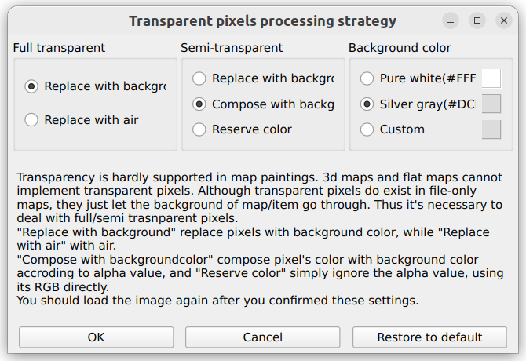

Transparent pixel handling strategies have different ways to handle pure transparent pixels (alpha=0) and semi-transparent pixels (alpha>0). A pure transparent pixel can either be replaced with the background color or set to air; a semi-transparent pixel can either be replaced with the background color or overlaid and blended with the background color, or its transparency property can be ignored and treated directly as an opaque pixel. Alternatively the background color can be set, the default background color is a light gray when the snow block is tiled, or you can choose pure white, or any custom color.

Please note: **If you want to import images containing fully/translucent pixels according to a custom strategy, be sure to set the transparent pixel processing strategy first, then import the image! Otherwise the images will only be processed according to the default processing strategy! If you have already imported the image before resetting the processing strategy, please re-import the image.**

Click **Import Image** and find the image you just converted in the file selection box that pops up. Look at the **Image Size** shown in the orange box below and make sure you didn't select the wrong image.

If there are no bugs, then this image will be shown on the left side.

Once the image is successfully imported, click **Next**.

The **go to next button is fixed in the upper right corner and will not be specifically marked in future images.**

## Step 2. Select the version and confirm the map type

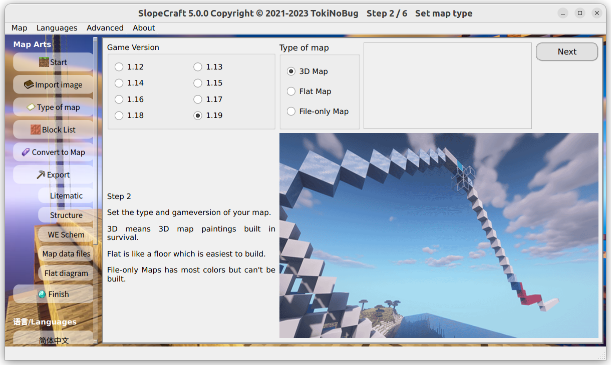

On this page, you need to set the map to correspond to **game version**.

At the moment from 1.12 to 1.19 are supported, I will continue to follow the updated version, but will not support the boss book before 1.12.

Note that there is no difference between 1.12 and 1.15 in the "picture quality" of the maps, as the flat map has **51 colors** and the 3D map has **153 colors**. 1.16 adds 7 basic colors to the netherworld tree, so the flat map can use **58 colors** and the 3D map can use **174 colors**. 1.16 adds 7 basic colors to the netherworld tree, so the flat map can use **58 colors** and the 3D map can use **174 colors**. 1.17 added colors for deep slate, pig iron blocks and glowing lichen, so you can use **61 colors** for flat maps and **183 colors** for 3D map.

_Tweets: Mojang Why give so many colors to the netherworld tree? Wouldn't it be good to have more flesh colors?_

Click next after confirming that there are no errors.

## Step 3. Set block list

The list of blocks is actually the "**Materials List**", or "**Palette**" of a map. **It determines which colors are in the palette of the map, and which blocks correspond to each color.**

This page is a bit more complicated, so I'll cover each section in turn. **(Actually, in general, the list of blocks doesn't need much convertion by itself)**


Each of the base colors is shown in the slider. In the **Enable** box, you can check **Whether to allow SlopeCraft to use this color**. By default, each base color will be checked (except for colors added in 1.16 in lower versions)

Below the enable box is the box **which corresponds to each color**. Only one block can be used for each color in the palette.
structure void

- You may think that many of the blocks in the diagram are different colors, but please note that **they are identical in the "eye of the map "** and the only basis for selection is whether the blocks are easy to mass-produce.
- Some base colors are only available in one block, however the palette cannot be left blank, so this option is unchangeable, like the glass or emerald block in the picture, it must be selected.

In the upper left corner there is a list of four preset blocks to choose from.

- Vanilla is the "**original**" one, trying to use the "original blocks" of each color. It is more suitable for creation mode, not for survival.
- Cheap is the **cheapest block**, making sure that every block is mass-produced. It is suitable for pre-survival.
- Elegant is to try to choose the "**most elegant block**" if it is possible to survive the actual installation, for example, try to choose the block that can't be stolen by Blackie, which is both beautiful and not too difficult to mass-produce. This is the default option.
- Shiny **is made for light and shadow**, it tries to choose glowing blocks, and tries to be gorgeous enough in light and shadow.
- Custom means you use a list of **custom** blocks.
  
The bottom left corner of the **priority to use concrete** and other buttons to facilitate bulk operation, the meaning is obvious, no more explanation.

When you are done with these settings, click Confirm. **On the left side of the Next button, it will show you how many colors you can use for this map.** If you disable some of the base colors, then this number will be reduced a bit. **So the richer the color palette and the larger the size of the map, the better the picture quality.**

Click Confirm and go to the next step.

## Step 4. Convert Image

After completing the above preliminaries, it's time to move on to the main meal: converting the image into a map.


The **Convert Image** button will adjust the color of the image to the color available in the palette of the ground picture, while the **Show Original Image** and **Show Converted Image** below show the original image and the converted ground picture respectively, so you can easily compare them.

The color space above has 7 options, **represents 7 ways to adjust the color.** Dithering then uses the Floyd-Steinberg algorithm, which tries to blend with several similar colors to try to fit the original image better.

Each of the first six conversion algorithms corresponds to six different color difference formulas. The algorithms RGB+ is the most recommended, RGB and XYZ are the fastest, Lab94 and Lab00 are better but slower, HSV has been less satisfactory and less recommended, GACvter is the slowest, but if the first 6 algorithms are not satisfactory, try it.

The first 6 algorithms only consider the color of the pixel, not the spatial location of the pixel, and they are called traditional algorithms. The seventh algorithm, GACvter, uses the results generated by the first 6 algorithms as "seeds" on which to find solutions with edge contours that are closer to the original image. This new algorithm is intelligent, considering both pixel color and position.

Each of these 7 convertions has a different effect on the same image.

We all want the ground picture to be as close to the original as possible, so you can try each convertion in turn and compare them back and forth with two buttons to choose the one that works best.

|  | 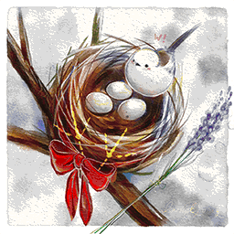 |
| :-------------------------------------------------------------------------: | :-------------------------------------------------------------------------------: |
|                              Before convertion                              |                                 After convertion                                  |

The process of converting images may be slow, especially for larger images. **If the progress bar suddenly stalls or even the window is not responding, please don't close the window, don't do anything, just wait patiently.** The process of converting images has a lot of calculation tasks, and it is normal to get stuck.

### GACter

GACter uses a Genetic Algorithm (GA) and you can set its parameters by simply clicking on **Ai converter parameters** under the **Advanced Features** menu.


If you understand GA, then these parameters don't need to be explained. If you don't understand it, just google it, or just leave it alone.

The only parameter that needs to be explained is the **maximum early convergence generations**, which refers to the maximum number of consecutive generations of failed merit search allowed. For example, if its value is 50 generations, then the algorithm terminates when it does not find a better solution for 50 consecutive generations, saving time. A larger **maximum early convergence generation** will prevent the algorithm from maturing prematurely, but will make it slower.

After selecting what you think is the best-looking map, it's time to move on to the final step of generating the map: **export**.

## Step 5. Export

There are 6 types of exports, and the following table documents the relationship between the various map types and the export types.

|              Export Type              | 3D Map | Flat Map | File-only Map |
| :-----------------------------------: | :----: | :------: | :-----------: |
|  Litematica schematic (\*.litematic)  |   ✔    |    ✔     |               |
| Vanilla structure block file (\*.nbt) |   ✔    |    ✔     |               |
|       WE schematics (\*.schem)        |   ✔    |    ✔     |
|        Map data file (\*.dat)         |   ✔    |    ✔     |       ✔       | ✔ |
|   Converted images (\*.png \*.jpg)    |   ✔    |    ✔     |       ✔       | ✔ |
|     Flat diagram (\*.png \*.jpg)      |        |    ✔     |

**Note: WE schematics (\*.schem) are only supported in version 1.13+. In 1.12, WE uses the old schematic format with the \*.schematic suffix, which is not currently supported by SlopeCraft.**

### Export as Litematica schematic / Vanilla structure block file / WE schematic / Flat diagram

After the color convertion is completed, the **Export as litematic** button lights up.

Click **Export as litematic** to jump to the corresponding screen.

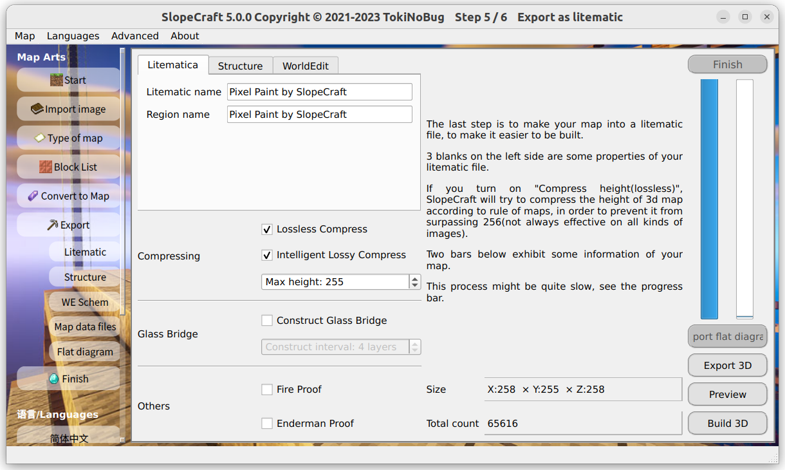

#### Build 3D structure

Click on Build 3D Structure and SlopeCraft will build the map into a 3D structure, displaying the projected dimensions and the total number of blocks.

**Please note that if the schematic y size exceeds 256 / 384, then never, ever continue exporting. A schematic that exceeds the height limit is meaningless!**

Here are the options that can be set when building a 3D structure.

#### Compress

SlopeCraft supports two types of compression: lossy and lossless.

In simple terms, lossless compression is a way to compress the total height of the ground picture at the cost of continuity while **strictly ensuring that the color of each pixel remains the same**, but it is more constrained and may not work as desired. It is no exaggeration to say that some pictures are incompressible, such as the pure white part. This is when a new compression technique is needed: intelligent lossy compression.

Lossy compression then **slightly tunes the color of individual pixels** and compresses the total height of the ground picture so that it is less than or equal to the maximum allowed height specified by the user. The lossy compression is implemented using a genetic algorithm, which is part of the population artificial intelligence and is the most technically advanced module in SlopeCraft. The maximum allowable height should not be lower than 14, otherwise the 3D map is likely to fail.

In general, the smaller the maximum allowable height for lossy compression, the more significant the loss of image quality. As follows, this image is made into a 3D map with a height of 255 frames and is now compressed with lossy compression (with lossless compression enabled). Figure 1 shows the result of the build with a maximum height of 100 frames, and Figure 2 shows the result of the build with a maximum height of 20 frames.

|  | 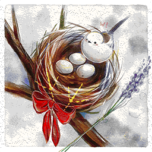 |
| :------------------------------------------------------------------------------------------: | :----------------------------------------------------------------------------------------: |
|                                          Figure  1                                           |                                          Figure 2                                          |

There is no significant change before and after compression, and the damage to the image quality is not obvious. However, we can still find some gray dots in the left and right white parts, and Figure 2 has more gray dots than Figure 1 due to the high compression degree. In addition, the genetic algorithm is a random optimization algorithm, and the modified pixels have some randomness and do not show an obvious regular pattern.

Lossy and lossless compression can be used together or separately. However, in general, if lossy compression is enabled, it makes no sense not to enable lossless compression. Pure lossy compression requires more pixels to be modified, which will cause more damage to the image quality, while lossless compression can complete the compression task with fewer pixels to be modified, largely reducing the damage to the image quality.

You can turn on both options for flat maps, but it **will not play any role**.

#### Glass bridge

There are many scattered blocks in each horizontal section of the three-dimensional map, which is extremely inconvenient to build, and if multiple pathways can be used to connect these scattered blocks, it will certainly make the construction easier. Building bridges is the process of connecting all the blocks in a horizontal plane with glass blocks to form pathways to assist the player in building.

There is no doubt that bridging consumes additional glass, so it is not recommended to perform bridging on every level of the diorama. By default, bridges are built every 4 levels, but you can modify this interval. If the interval is too large, the effect of bridge building will be reduced; if the interval is too small, the glass will be wasted.

For more information on map compression and bridging, you can read [Principle Introduction](https://github.com/ToKiNoBug/SlopeCraftTutorial/blob/main/BasicPrinciple/Principle%20of%20map%20pixel%20arts.md)。

[AbrasiveBoar902](https://github.com/AbrasiveBoar902) has been of great help in optimizing the performance of the hitch, and his help is appreciated.

#### Fire proof / Enderman proof

As the name implies, this is to protect the combustible blocks and avoid the little black steal something. The specific method is to wrap each of these blocks with glass exposed surface, pro-tested effective. But this will also consume a lot of glass at the same time, need to choose carefully.

After building the 3D structure, SlopeCraft will automatically bring up a preview window to view the transformed map and materials list. The transformed map is shown here because lossy compression may further change the image and it is necessary to re-present the state of the image.

| 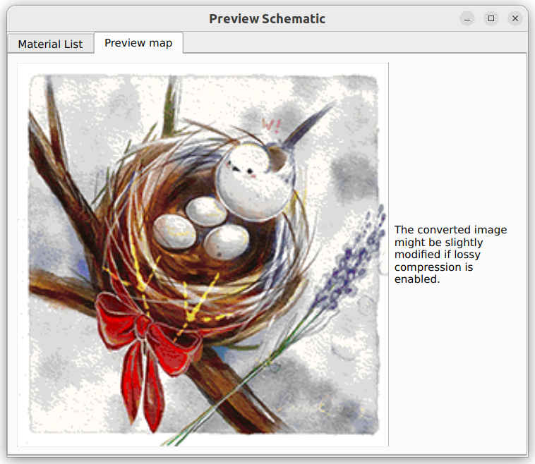 | 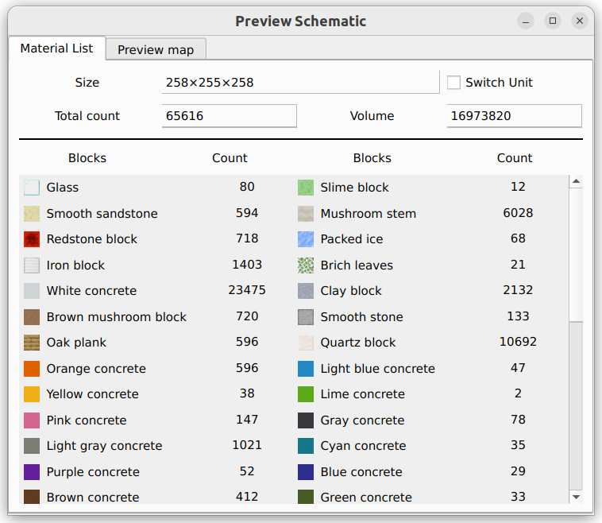 |
| :-----------------------------------------------------------------------------------------------: | :---------------------------------------------------------------------------------------------: |
|                                            Map preview                                            |                                          Material list                                          |

The first three export methods each allow you to enter additional export options, attach additional meta information, and are described below in turn.

#### Litematica options

In the fields **Litematic name**, **Litematic author** and **Litematic area name** , you can fill in the information of the litematic file. However, it is not mandatory.

#### Vanilla structure option

The original structured block files are stored in a sparse 3d matrix, with structure void where they are not stored. This storage method makes structured block files the most compatible but least compressed format of the original.

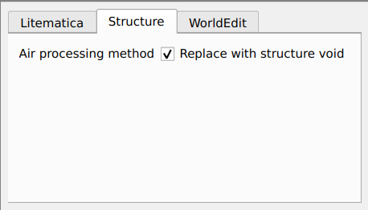

Thus structural kettle block files have two options for storing air : as structure void, or as-is. Storing as structure void can be a great space saver, but it cannot overwrite other non-air  when pasted out in structural ; storing as air  can overcome this problem, but the file size will be large.

#### WE schematic options

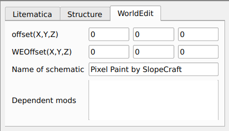

The WE schematics have slightly more attributes that are derived from reverse engineering the schematics generated by WorldEdit and correspond directly to the nbt tag of the same name. I'm not sure how these meta-attributes affect the schematic, since I hardly ever use WE.

#### Export as flat diagram

Click **Export Flat Diagram** to export a flat map as a flat diagram, where each pixel is represented by a block.

### Export converted image

After Step 4. is completed, click **Show Converted Image** and then click **Save Current Image** to save the transformed image as a flat schematic.

### Export as map data files

After the color convertion is completed, the **Export as Map Data File** button lights up. Click **Export as Map Data File** to jump to the corresponding screen.

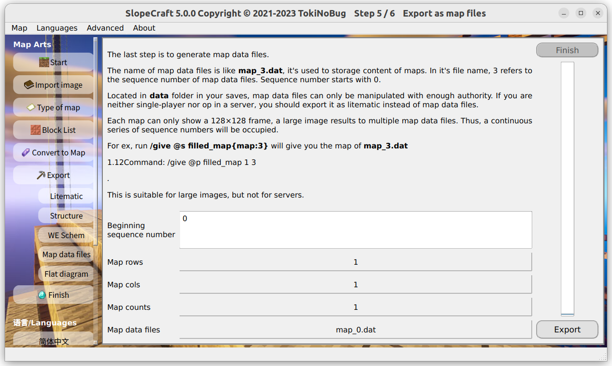

This page shows the number of rows and columns of the map corresponding to the map, the number of files and the file name of the map data file to be exported.s

#### Set initinal map serial number

The file name of a map data file is `map_i.dat`, where i is an integer greater than or equal to 0, such as `map_3.dat`. **`i` is the serial number of this map data file. The serial number is actually the unique identifier of the map data file**. Under normal circumstances, our generated map data file should not overwrite unrelated map data files, so we need to pay more attention to setting the initial serial number.

Pressing F3+H in-game will allow you to view item details, **including the Id of the map item, which is the serial number of the corresponding map data file**. The map item shown below corresponds to a map data file named `map_6.dat`.


## Step 6. Import map to Minecraft

### Import Litematica schematic / Vanilla structure file / WE schematic

Click **Finish** to jump to the last page.


Click **View Exported Files** and it will help you to display the projection file you just generated directly in the folder. Click **Exit** to exit the program.

Next, move the exported projection file to the .minecraft/schematic folder. Then open Minecraft, go to the archive/server, and import this projection in the place where you want to create the map drawing.

When placing the projection, please note that **the x and z coordinates of the projection origin must be `-65+k×128`, where k is any integer**. y coordinates are arbitrary. For example, (63,62,-65). Only then can the **ground drawing be aligned with the map's grid**.

Then start realizing this projection or just paste the schematic. Once this is done, create a new map inside the map. Each map should be unscaled, as each pixel point corresponds to a block. Place them in order inside the item display box and you're done.

- If it is a 2×2 map map, then you should create 2×2, i.e. 4 maps.
- If your game version is 1.14 and above, then it is better to lock the map with a glass sheet inside the cartography table.

### Import map data files

If you want to get the map with the `/give` command.

The starting number can be set arbitrarily, as long as it does not overwrite an unrelated map.

- In 1.12, use `/give @s filled_map 1 i` to get a map with number i. In 1.13+, use `/give @s filled_map{map:i}` to get a map with number i.
- In 1.13+, use `/give @s filled_map{map:i}` to get a map with number i.

If you do not want to use the command, replace only the map data file with following steps:

1. First create `n` maps corresponding to the map drawing, n is the number of map data files displayed by SlopeCraft, in this case 4.
2. Press <kbd>F3</kbd> + <kbd>H</kbd> in Minecraft. Check the serial numbers corresponding to the map data files. These maps should have serial numbers `a`~`(a+n-1)`, n in total.
3. Close the game and enter the value `a` in the **Map file start number** field of SlopeCraft.
4. Click Export and select the data folder under Archive.
5. Close SlopeCraft, open the game, and the `n` map should have been successfully replaced with a map.
6. If you are worried about overwriting unrelated maps by entering the wrong map data file number, you can create a temporary folder and select it when exporting. After confirming the map serial number is correct, then copy and paste the map data file you want to replace.

## Batch Processing

If you want to batch convert multiple images to maps, you need to set the properties of maps in other interface first, such as game version, map type, block list, conversion algorithm, export settings, etc.


Selecting multiple images on the import image page will automatically bring up the batch processing window.

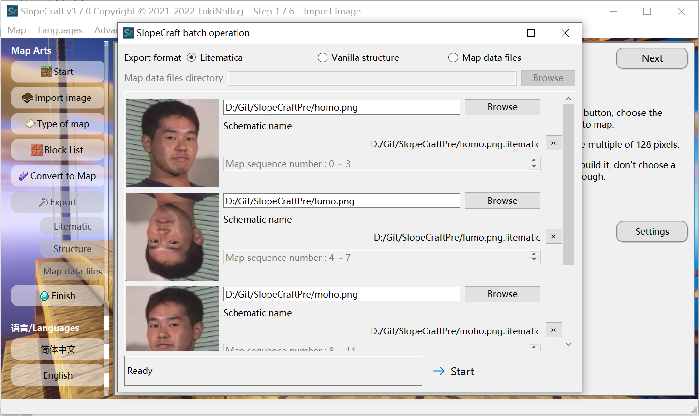

At the top, you can choose the format of the export, and click **Start** to start batch processing.

## Advanced functions

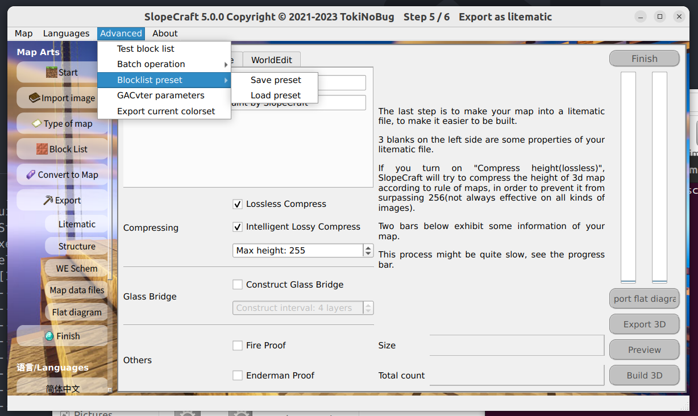

You can see some advanced operations in the "Advanced" menu. Each of them is described below.

### Test block list

Missing blocks in the projection are basically caused by **id misspellings**. If you import many blocks at once, this feature allows you to quickly test each block in the block list for id errors.

Testing the block list generates a special structured block file that contains every available block for each base color (except for those that do not match the version). Each block in the structure file is arranged in the order in which it appears in the block list.

If everything is fine, none of the blocks will be missing; if not, there is an id error in the corresponding block.

The following figure shows the effect. Due to the long projection, it is divided into two screenshots.

| 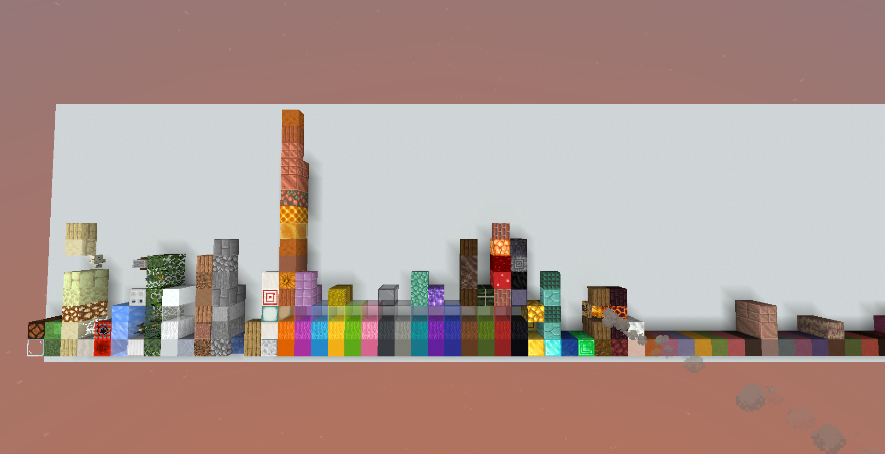 | 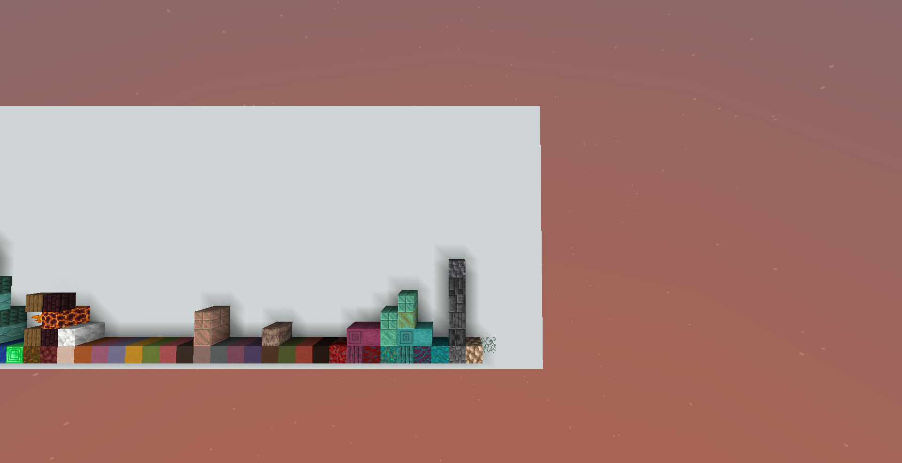 |
| :------------------------------------------------------------------------: | :-------------------------------------------------------------------------: |
|                                 Left half                                  |                                 Right half                                  |

### Batch operation

Batch operations have been described above, and this menu is simply designed to bypass the interface logic and jump to the page where the export is set up before the image is entered. I have to admit that the interface logic of SlopeCraft is not as well designed as VisualCraft.

### Blocklist preset

SlopeCraft allows to export the current block list settings to a file, or to load a preset file. The file is stored in json and has the suffix `.sc_preset_json`.

### GACvter parameters

This menu item allows the user to set the parameters of the GACvter, as described above.

### Export current colorset

This menu item allows the user to export the current color table as a $16\times 16$ png image, containing all the colors currently available.

|  |  |  |
| :--------------------------------------------------------------------------: | :----------------------------------------------------------------------------: | :--------------------------------------------------------------------------------: |
|                                   1.19 3D                                    |                                   1.19 Flat                                    |                                   1.19 File-only                                   |

## Customize blocklist

If you are not satisfied with my preset blocks and want to add other original blocks or even mod blocks yourself, this chapter will show you how to add and use custom blocks in SlopeCraft.

### Preliminary Information

You need to have the following information about the block.

1. The **complete** id of the block, containing the **namespace prefix** and **all block attributes**.

   If the upper half of the wax-coated copper block is tiled.

   ``` file
   minecraft:waxed_copper_slab[type=top,waterlogged=false]
   ```

   In this ``minecraft:`` is the namespace prefix for the original block, and the contents of the brackets are all block attributes. To be on the safe side, you should set the corresponding value for each block attribute.

2. The earliest version of the game in which the block appeared

   SlopeCraft has agreed on the following values in the block list to refer to major versions:

   | Numbers |     Versions      |
   | :-----: | :---------------: |
   |    0    | Earlier than 1.12 |
   |   12    |       1.12        |
   |   13    |       1.13        |
   |   14    |       1.14        |
   |   15    |       1.15        |
   |   16    |       1.16        |
   |   17    |       1.17        |
   |   18    |       1.18        |
   |   19    |       1.19        |
   |   255   |  Future Versions  |

   Normally you shouldn't use 255, it's just a reserved value. If you have to assign a block to a future version, then everything that results is an undefined feature -- I don't know what will happen.

3. The id of the block in 1.12

   This property was added because Mojang changed the ids of quite a few blocks from 1.12 to 1.13. If the block you want to add was not added in 1.12, or if the id has not changed, you can fill in the empty string.

4. Base color of the block

   This is probably the easiest place to go wrong. For the original block, you can check the [Minecraft Wiki](ttps://wiki.biligame.com/mc/%E5%9C%B0%E5%9B%BE%E7%89%A9%E5%93%81%E6%A0%BC%E5%BC%8F#idcounts.dat_.E6.A0.BC.E5.BC.8F). If it's a mod custom block, either figure out how to measure it yourself or ask the mod developer.

   If you don't know what the base color is, go to [principles introduction](./principles-introduction.md)

5. Chinese name of the block
6. English name of the block
7. Whether the block needs to attach other blocks below itself
8. Whether the block glows
9. Whether the block is combustible
10. Whether the block can be stolen by the last shadow man
11. The texture image of the block (a 16*16 pixel png image is recommended)

### Blocks and block list

In SlopeCraft, the block list is stored in json format, and the related images are placed in the FixedBlocks and CustomBlocks folders.

There are two types of block lists: fixed block lists and custom block lists. The FixedBlocks list is the most basic list of blocks I provide, stored in **FixedBlocks.json** (the corresponding images are in the **FixedBlocks** folder), ensuring that there is a corresponding block for each base color. Although the blocks in the block list are in fact determined at program runtime, **you should not modify it**.

The custom blocks list is stored in **CustomBlocks.json**, and the corresponding images are in the **CustomBlocks** folder, which is a user-defined blocks list that allows the user flexibility to edit it. I have written some half-brick blocks in there, which can be used as a reference.

Each block has the following properties.

|  Property Name   |  Type  |            Required            |                              Default                               | Description                                                             |
| :--------------: | :----: | :----------------------------: | :----------------------------------------------------------------: | :---------------------------------------------------------------------- |
|    baseColor     |  byte  |              yes               |                                                                    | The map base color of the block                                         |
|        id        | string |              Yes               | The id of the block, including namespace and detailed block status |
|     version      |  byte  | is the earliest version of the |                               block.                               | nameZH                                                                  |
|      nameZH      | string |              Yes               |                            Chinese name                            |
|      nameEN      | string |              Yes               |                            English name                            |
|       icon       | string |              Yes               |       The file name of the corresponding image of the block.       |
|      idOld       | string |               No               |                            empty string                            | The id of the box in 1.12                                               |
|    needGlass     |  bool  |               no               |                               false                                | Indicates whether there must be other blocks at the bottom of the block |
|    isGlowing     |  bool  |               no               |                               false                                | Indicates whether the block is glowing                                  |
| endermanPickable |  bool  |               no               |                               false                                | Indicates whether or not the block can be stolen by an enderman         |
|     burnable     |  bool  |               no               |                               false                                | Indicates if the block can be burned                                    |

**The property `wallUseable` has been removed because the wall ground drawing has been removed.**

In json format, it is expressed as:

```json
{
   "baseColor":11,
   "id":"minecraft:cobblestone_slab[type=top,waterlogged=false]",
   "nameZH":"圆石上半砖",
   "nameEN":"Cobblestone slab",
   "icon":"cobblestone.png",
   "version":0,
   "idOld":"minecraft:stone_slab[half=top,variant=cobblestone]"
}
```

The above json message shows the information of a block with half a tile on a round stone, parsed as follows.

1. Its base color is 11, which is also the base color of round stone, stone tile, and stone.
2. Its block id is "minecraft:cobblestone\_slab[type=top,waterlogged=false]", the status of the block in brackets indicates that it is a top half brick and does not contain water.
3. Its Chinese name is "圆石上半砖" and its English name is "Cobblestone slab".
4. Its image is a picture named "cobblestone.png", which is placed under the CustomBlocks folder.
5. Its earliest appearance is version 0, which means it was added before 1.12.
6. Since its block id changed in 1.13, its block id in 1.12 is the value of idOld.
