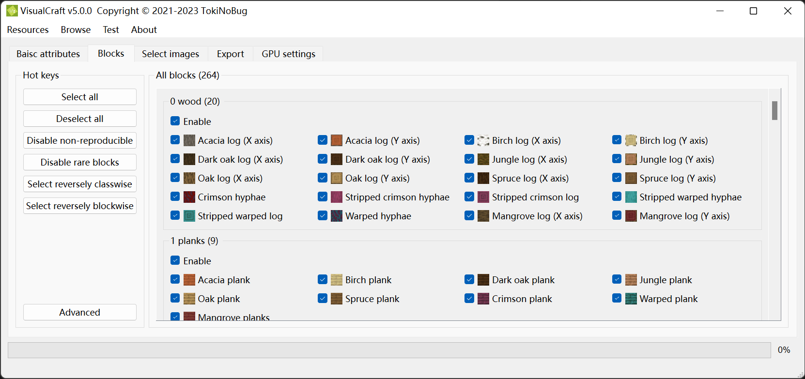

# VisualCraft Tutorial

## Description

VisualCraft is a brand-new pixel art generator for Minecraft. It is developed by TokiNoBug, and is a subproject of SlopeCraft. Unlike other counterparts, VisualCraft aims to catch up with latest versions of Minecraft(from 1.12 to latest), providing greatest functions and supporting as much MC features as possible.

Now VisualCraft is able to parse many 3rd party resource packs and allowing to add custom new blocks. Different from traditional methods, VisualCraft understands resource packs by parsing block models, which is rather similiar with what Minecraft does. Thus custom block models are supported.

When it comes to export, VisualCraft supports multiple formats, like Litematica mod(**\*.litematic**), WorldEdit schematic(**\*.schem**)(1.13+ only), vanilla structure block file(**\*.nbt**), flat diagram image(**\*.png**) and so on.

VisualCraft composes half-transparent blocks to produce more colors. No greater than 65534 colors are supported, and thus the maximum layers should now exceeds 3.

The great amount of colors makes GPU accleration necessary. Now OpenCL is supported, but it can also run on CPU only.

## 1. Basic Attributes

On the first page you can setup basical attributes. Pixel art directions and Minecraft versions can be set on the left side, while **biome**, **max layers** and **transparent leaves** can be set below.

It is necessary to explain the last three options:

1. **Max layers** refers to the maximum block layers of the pixel art, since VisualCraft supports superimposing transparent blocks on non-transparent blocks. 
   - Max layers should be a positive number, and no greater than 3, otherwise the number of blocks will exceed 65534, beyond the capacity of `uint16_t`.
2. **Biome** refers to what biome the pixel art will be built in. In Minecraft, the colors of grass, leaves and vines differs in biomes, so it is necessary to input the biome.
3. **Transparent leaves** refers to whether leaves are treated as transparent blocks. 
   - The apperaence of leaves are different by render options. If the graphics quality is not fast, leaves are transparent blocks that can be see through, otherwise they are not transparent, and transparent pixels in their textures are replaced with black(`0x000000`).

Resource packs and block state list(BSL) jsons can be set on the right side. Resource packs are zips that Minecraft receives, and BSL are json files storing block informations. Only blocks recorded in BSL can be used by VisualCraft.

Resource packs and BSL are represented in two list widgets. Click **Add** and you can select a file and add it to the list. To remove one or more items from the list, select them and click **Remove**. Note that only selected items can be removed. You can sort items by dragging them.  If you hope to use an item, turn on its checkbox, otherwise turn it off. When multiple resource packs are parsed, they stack in the represented order, like what Minecraft does. Multiple BSL jsons are parsed similiar.

 `Vanilla` and `Default` are special items that can not be removed, because they represent fundamental resource pack and BSL respectively. But you can still disable them, by turing off their checkbox.

 If you have finished basic attributes, find **Resource** menu and click **Load resources** to load resources.

## 2. Allowed Blocks

After you load resources, all avaliable blocks will appear on the second page. Blocks are separated by classes. You can select or deselect any blocks and any classes.