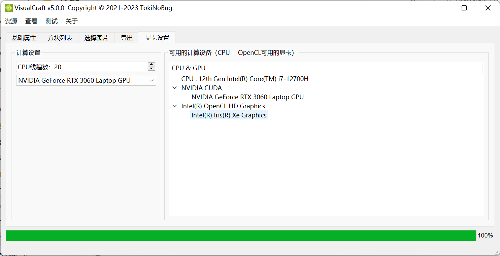
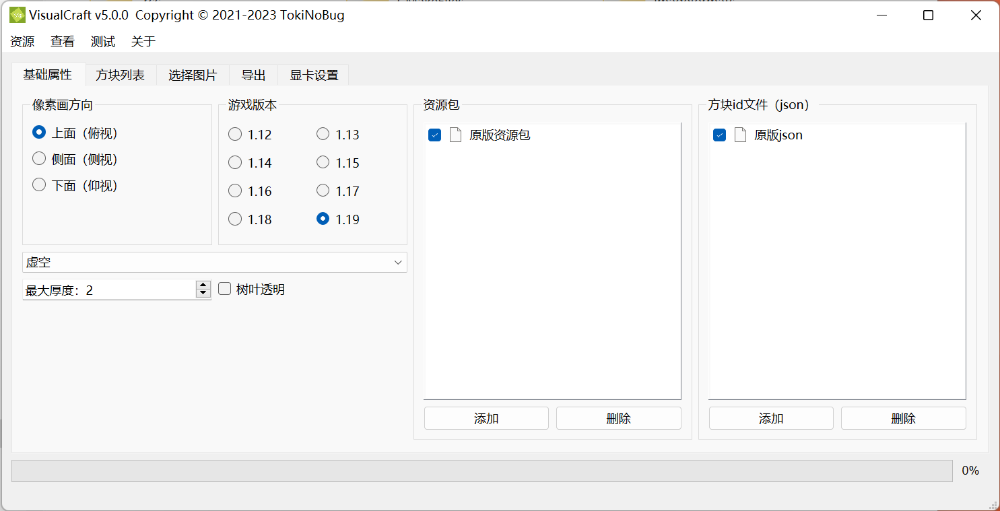
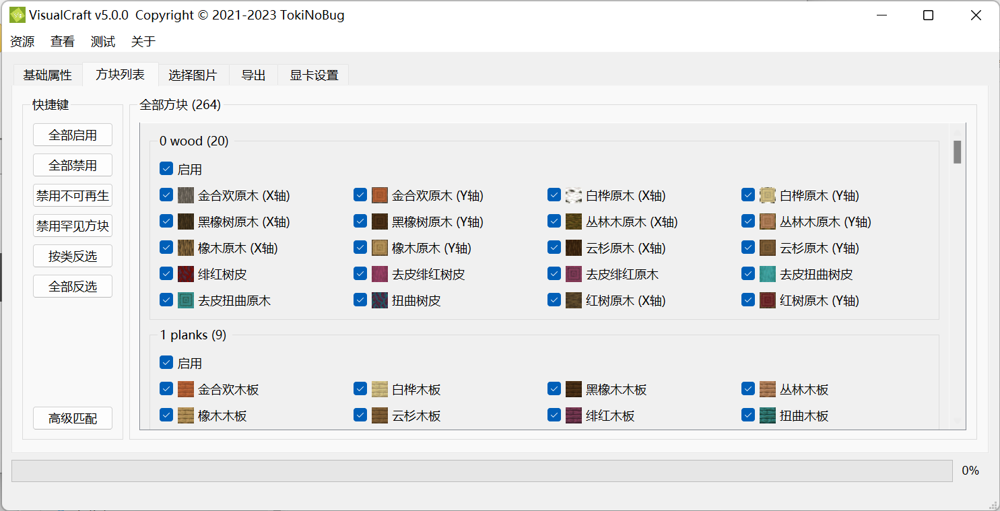

# VisualCraft 教程

## 简介

VisualCraft 是一款全新的 Minecraft 像素画生成器，由 MC 玩家 TokiNoBug 开发，是 SlopeCraft 的子项目。与其他类似的软件不同，VisualCraft 旨在跟进最新的 MC 版本 (1.12~最新版)、支持最多的 MC 特性，提供最强大的功能。

目前 VisualCraft 能够解析许多第三方资源包，也允许自定义增加加新方块。与传统的思路不同，VisualCraft 以方块模型的方式来解析资源包，尽量贴近 Minecraft 的方式，因此支持各种自定义的方块模型。

在导出方面，VisualCraft 支持 Litematica mod 的投影 (**\*.litematic**)、WorldEdit 原理图 (**\*.shem**)(仅 1.13+可用)、原版结构方块文件 (**\*.nbt**)、平面示意图 (**\*.png**) 等方式。

VisualCraft 支持用各种透明方块互相叠加，产生更多的颜色。软件最多支持不超过 65534 种颜色，受此限制，像素画的层数不超过 3 层。

由于颜色数量很多，VisualCraft 使用了显卡加速。目前支持的 API 有 OpenCL，但也能只用 CPU 计算。

## Step 0. 显卡设置

这个步骤不是强制性的。你可以跳过它，但如果你的图像很大或者要生成 3 层的像素画，这一步能极大提升 VisualCraft 的运行效率。



到现在为止，有两个计算选项：CPU 线程数和计算设备。

在第一个框中，你可以设置 CPU 线程数。默认值是你的 CPU 的逻辑线程数，来自 `std::thread::hardware_concurrency()` 的返回值。你可以把它设置得大一点，这样可以更好地利用 CPU 内核，但过多的线程会给线程调度带来额外的负担，这花费更多的时间，且更耗电。

你可以在下一个单选框中选择一个计算设备。这个设备只在图像转换时使用，所有可用的设备都列在右边的树状小部件中，设备是按平台 (OpenCL platform，可以粗浅理解为不同的厂商，但这不准确) 分类的。现在只支持 OpenCL 这一种 API。对于已经放弃 OpenCL 的 MacOS，我正计划支持 Metal，但正在鸽。

如果 VisualCraft 是在没有 GPU API 的情况下编译的，那么只能使用 CPU 计算，不能利用显卡加速。

## Step 1. 基础属性



在第一页，你可以设置基本的属性。左边可以设置像素画方向和 Minecraft 版本，而**生物群系**、**最大层数**和**树叶透明**可以在下面设置。

像素画方向和 MC 版本显而易见，而最后三个选项有必要说明。

1. **最大层数**指的是像素画的最大块层数，因为 VisualCraft 支持将透明方块叠加在非透明方块上。
    - 最大层数应该是一个正数，并且不大于 3，否则颜色的数量将超过 65534，超出`uint16_t`的表示范围。
2. **生物群系**指的是像素画建筑地的生物群系。
    - 在 Minecraft 中，草、叶子和藤蔓的颜色与生物群系有关，所以有必要输入生物群系。
3. **树叶透明**指的是叶子是否被当作透明块。
    - 叶子的外观因渲染选项而不同。如果图形质量不低，叶子就是透明方块；否则就不透明，其材质中的透明像素将被替换为黑色（`0x000000`）。

资源包和方块状态列表 (BSL)  可以在右边设置。资源包是 可以给 Minecraft 输入的压缩包，而 BSL 是存储方块信息的 json 文件。只有记录在 BSL 中的方块才能被 VisualCraft 使用。

资源包和 BSL 在两个列表中表示。点击**添加**，你可以选择一个文件并将其添加到列表中。要从列表中删除一个或多个元素，选择它们并点击**删除**。注意，只有选中的元素可以被删除。你可以通过拖动元素来排序。如果你希望使用某个元素，就勾选它的复选框，否则就不勾选。当多个资源包被解析时，它们会按照列表中的顺序叠加，就像 Minecraft 所做的那样。多个 BSL 的叠加方式和资源包一样。

**原版资源包**和 **原版 json**是不能被移除的特殊元素，因为它们分别代表基本资源包和 BSL。但是你仍然可以通过关闭它们的复选框来禁用它们。


如果你已经设置好了基础属性，那么在**资源**菜单中点击**加载资源**就可以让 VisualCraft 加载这些资源。

## Step 2. 设置可用方块



加载资源后，所有可用的方块会出现在第二页，按不同类别区分开来。你可以选择或取消选择任何单个方块和任何类。

### 快捷键

左边的这些快捷键可用更方便的选择或禁用方块。为消除歧义，特此说明：**下文中“选择”“启用”表达相同的含义；“禁用”“取消勾选”也表达相同的含义。**

|   按键名称   | 效果                                                                   |
| :----------: | :--------------------------------------------------------------------- |
|   全部启用   | 选中全部方块                                                           |
|   全部禁用   | 禁用全部方块                                                           |
| 禁用不可再生 | 禁用所有不可再生方块                                                   |
| 禁用罕见方块 | 禁用所有罕见方块                                                       |
|   按类反选   | 对每种类反选，不影响方块的勾选情况                                     |
|   全部反选   | 将所有方块反选，不影响类的勾选情况                                     |
|   高级匹配   | 弹出一个子窗口，允许你按自定义的规格匹配方块，并把它们设为选中或补选中 |


完成以上设置后，找到**资源**菜单，点击**设置可用方块**，设置可用的方块。

## Step 3. 加载图像


事实上，从最简主义来说，你为一需要做的就是添加图片，然后进入下一页。在这一段中，我将介绍这一页的部件。

在你设置了选定的方块后，颜色的数量将在**调色算法**后显示。

有几种算法可以将图像转换为像素画。VisualCraft 和 SlopeCraft 几乎使用同一套算法实现，所以这些选项是相同的。唯一的区别是 VisualCraft 可以显卡加速，因为它可能要处理超过 1 万种颜色和更大的图像。

导入图像的逻辑与导入资源包和 BSL 相似。点击**+**添加图片，点击**-**删除选定的图片。VisualCraft 设计之初就是批量处理工具，所以所有的图片都放在一个列表中。如果你点击一个图像，它将被显示和转换。

你可以改变显示选项。打开**显示原始尺寸**，强制所有图像按其原始尺寸显示，无论 label 尺寸如何。选择**显示原图**和**显示转化后图像**来决定是否显示相应的图像。

## Step 4. 导出


在这个页面，你可以告诉 VisualCraft 如何导出像素画和图像。支持 5 种导出类型。

|     类型     | 文件名扩展名  | 描述                                       |
| :----------: | :-----------: | :----------------------------------------- |
|  Litematica  | \*.litematic  | Litematica mod 投影                        |
| 结构方块文件 |    \*.nbt     | 原版结构方块文件                           |
|  WE 原理图   |   \*.schem    | WorldEdit mod 原理图 (1.13+)               |
|  转化后图像  | \*.png \*.jpg | 转化后的图像                               |
|  平面示意图  |    \*.png     | 将每个像素都换成对应方块，形成的平面示意图 |

由于 VisualCraft 天生就是批量操作工具，你可以通过在单选框中选择一个类型，然后点击**设置导出位置**来设置生成文件的文件夹。此操作将在相关的栏目中填入导出的文件名。

如果你希望改变导出方式，只需修改导出表。从第三栏到第七栏都是可编辑的。

当你点击**开始执行**时，VisualCraft 将根据表格的内容来执行。如果一个单元格是空的，它将被跳过；否则这个单元格中的文件名将被解析。如果扩展名不正确，可能会发生错误。

值得注意的是，平面图可能由多个图片组成，因为一个像素画可能有多个层次。因此，单元格中的文本实际上是一个由分号"`;`"分隔的文件名列表（**注意：半角字符！**）。例如：

```bash
# 两层
D:/image00_layer0.png;D:/image00_layer1.png
# 三层
D:/image01_layer0.png;D:/image01_layer1.png;D:/image01_layer2.png
# 单层
D:/image01_layer0.png
```

如果分号的数量不正确，也会发生错误。

### 导出选项


在这个页面，你可以设置导出文件的属性。Litematica 投影、结构方块文件和 WE 原理图的选项与 SlopeCraft 中的相同。而平面图的选项是值得解释的。

由于平面图用方块来表示整个像素画，所以画水平线和垂直线来把整个图像分成几块是很有用的。默认情况下，分割线按每 16 方块绘制一条，这就是 Minecraft 区块的大小。你可以改变中的边距，或者勾选复选框来禁用分割线。

平面图是由 libpng 生成的，它确实是一个大图像，所以你可以通过**png 压缩级别**告诉 libpng 如何压缩图像。这两个级别数字的范围是[0,9]。更大的压缩级别意味着更好的压缩效果和更多的编码时间，而更大的内存级别意味着要使用更多的内存。**如果你对图像和文件压缩不熟悉，保持默认值即可**。
