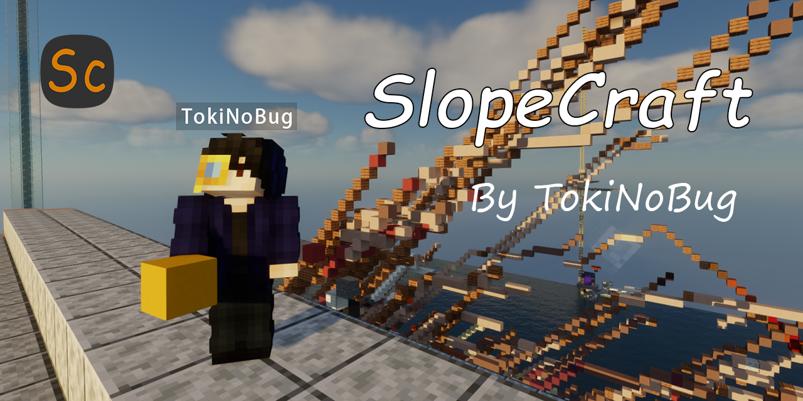

# Welcome to SlopeCraft Documentation

## About SlopeCraft

SlopeCraft is a project about generating (map) pixel arts in Minecraft, including following tools:

|    Name     | Description                                                                                                                                   |
| :---------: | :-------------------------------------------------------------------------------------------------------------------------------------------- |
| SlopeCraft  | Generator for **map** pixel arts(including but not only 3D maps). **Not suitable for looking to directly**.                                   |
| VisualCraft | Generator for traditional pixel arts, which is **suitable for looking to directly but not for maps**.   All viewing directions are supported. |
| imageCutter | An assitant tool to seperate and resize images                                                                                                |
|  MapViewer  | An assitant tool to browse Minecraft map data files                                                                                           |
|    vccl     | Command line version of  VisualCraft.                                                                                                         |

## Why SlopeCraft?

Most players have already get used to pixel arts, they place blocks to form them, and look at them from far beyond or far far away. But when they learned to use map, trying to record their pixel arts by map and subsequently placing maps into item frames, something weird happens: what map represent is obviously different from what their eyes see directly. 

SlopeCraft is invented to fix this difference. So pixel arts generated by SlopeCraft is not designed to be looked directly.

## Why VisualCraft?

You may not agree with that VisualCraft is something new, because there are lots of pixel art generators on the internet, for example, SpriteCraft. I must reckon that they are great works, and for a long time I don't think it necessary to invent it again. 

By I found that there are some new techniques that are rarely tried, for example:

1. Superimposing half-transparent blocks on non-transparent blocks to produce **thousands of new colors**
2. Telling the **biome** where you place the pixel art so that **colors of grass and leaves can be computed correctly**
3. Understanding **customized block models** from 3rd party resource packs.

When I learned that there are so many new skills that haven't been exploited, I decided to write a new one, VisualCraft, to bring them to reality.
